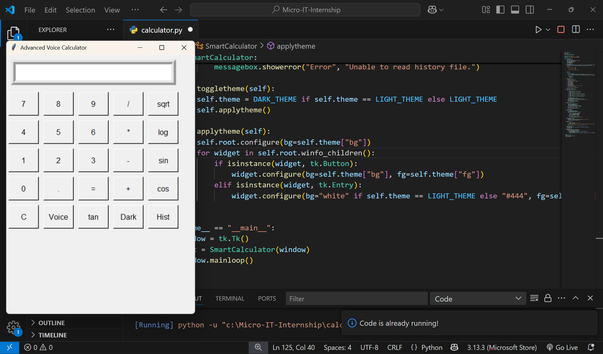
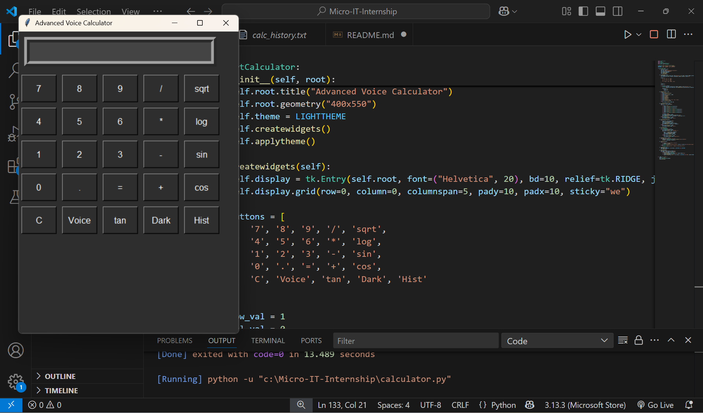
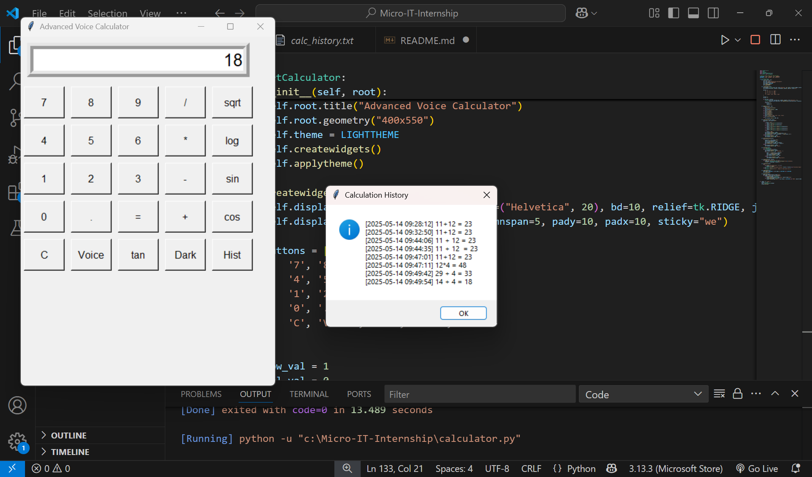

# Advanced Voice + Scientific Calculator

This is a unique, AI-assisted calculator project built for the **Micro IT India Internship**. It features:

- Basic arithmetic operations
- Scientific functions: sin, cos, tan, sqrt, log
- Voice input using Google Speech Recognition
- History logging with timestamps
- Dark/light mode toggle

## Technologies Used:
- Python
- Tkinter
- Math module
- SpeechRecognition
- datetime

## Screenshots:

DARK MODE :  
HISTORY :  

## How to Run:
Install dependencies:
```bash
pip install SpeechRecognition
pip install pyaudio
